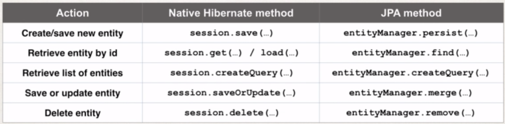

## **Setup**
https://stackoverflow.com/questions/15508967/change-root-context-for-a-servlet-in-an-intellij-idea-project/15511476#15511476
https://www.youtube.com/watch?time_continue=73&v=kDNihsx8j8k

## IoC
> Design process of externalizing, the construction and management of your objects
> You app will outsource the creation and management of the objects, and that outsourcing will be handled by a object factory

## Spring Container
> Primary functions:
>* Create and manage objects (IoC)
>* Inject object's dependencies (DI)

## Configuring 
> XML config
> Java Annotations
> Java Source Code


## Spring dev process
> Configure your Spring Beans

> Create a spring container
>* Spring container is generically known as **Application Context**
>* Specialised implementations
>* 1. ClassPathXmlApplicationContext
>* 2. AnnotationConfigApplicationContext
>* 3. GenericWebApplicationContext
>* others
> Retrieve beans from spring container


## **Spring Bean**
> A "Spring Bean" is simply a Java object.
> When Java objects are created by the Spring Container, then Spring refers to them as "Spring Beans".
> Spring Beans are created from normal Java classes .... just like Java objects.
> In summary, whenever you see "Spring Bean", just think Java object. 


> Why do we specify the Coach interface in getBean()?
> When we pass the interface to the method, behind the scenes Spring will cast the object for you.
> However, there are some slight differences than normal casting.
> From the Spring docs:
> Behaves the same as getBean(String), but provides a measure of type safety by throwing a BeanNotOfRequiredTypeException if the bean is not of the required type. This means that ClassCastException can't be thrown on casting the result correctly, as can happen with getBean(String).


## **Dependency Injection**
> The client delegates to calls to another object the responsibility of providing its dependencies.

> Question:
> I was wondering why you created a no arg constructor? I thought that they are implied by Java and only required when you also have an overloaded constructor. Or is this a Spring specific thing?

> Answered by: 
> When you don’t define any constructor in your class, compiler defines default one for you, however when you declare any constructor (in your example you have already defined a parameterized constructor), compiler doesn’t do it for you.

> Since you have defined a constructor in class code, compiler didn’t create default one. While creating object you are invoking default one, which doesn’t exist in class code. Then the code gives an compilation error.

## **Generic Setup**
``` java
// Generic interface
Interface myInterface = context.getBean("linkName", Interface.class);
myInterface.doSomething();

// For explicit implementation - usually to access the additional methods in the implemented interface
ImplementationInterface myInterface = context.getBean("linkName", ImplementationInterface.class);
myInterface.doSomething2();
```
``` xml
<bean id="linkName" class="location.of.implementationInterface">
```


## **Bean scope**
> Default bean is singleton 
>* Spring Container creates only one instance of the bean, by default

>* It is cached in memory

>* All requests for the bean
>* will return a SHARED reference to the SAME bean

> Prototype scope: new object for each request


## **Bean Life Cycle**
______
Special Note about init and destroy Method Signatures

When using XML configuration, I want to provide additional details regarding the method signatures of the init-method  and destroy-method .

Access modifier
The method can have any access modifier (public, protected, private)

Return type
The method can have any return type. However, "void' is most commonly used. If you give a return type just note that you will not be able to capture the return value. As a result, "void" is commonly used.

Method name
The method can have any method name.

Arguments
The method can not accept any arguments. The method should be no-arg.
______

There is a subtle point you need to be aware of with "prototype" scoped beans.

For "prototype" scoped beans, Spring does not call the destroy method.  Gasp!  

In contrast to the other scopes, Spring does not manage the complete lifecycle of a prototype bean: the container instantiates, configures, and otherwise assembles a prototype object, and hands it to the client, with no further record of that prototype instance.

Thus, although initialization lifecycle callback methods are called on all objects regardless of scope, in the case of prototypes, configured destruction lifecycle callbacks are not called. The client code must clean up prototype-scoped objects and release expensive resources that the prototype bean(s) are holding. 

This also applies to both XML configuration and Annotation-based configuration.
___

> for singleton beans - both init-method and destroy-method are called
> for prototype beans - only init-method is called


## **Java Annotations**
> At compiler time, compiler will check/verify

> Spring will scan your Java classes for special annotations
> Automatically register the beans in the Spring container
@Component("TennisCoach")

@Component
> Spring also supports Default Bean IDs
>* Default bean id: the class name, make first letter lower-case

> For DI, Spring can use auto wiring
> Spring will look for a class that matches the property
>* matches by type: class or interface
> Spring will inject it automatically.. hence it is autowired

___
AUTOWIRING
FAQ: What if there are multiple FortuneService implementations?
When using autowiring, what if there are multiple FortuneService implementations? 

ANSWER
Spring has special support to handle this case. Use the @Qualifier annotation. We'll cover this later in the course with slides and code examples. But don't worry, we will address all scenarios :-)

___
Question
I have finished the video "Constructor Injection - Writing Code part2". 
I have commented the Autowired annotation. But still it worked. How did it work?

Answer
> This is a new feature of Spring 4.3.
> Here is the snippet from the Spring Docs.

Section 1.9.2: Autowired
> As of Spring Framework 4.3, an @Autowired annotation on such a constructor is no longer necessary if the target bean only defines one constructor to begin with. However, if several constructors are available, at least one must be annotated to teach the container which one to use.
> I personally prefer to use the @Autowired annotation because it makes the code more readable. But as mentioned, the @Autowired is not required for this scenario.
___

**Field injection**
> Just put @Autowired on field - not need for setter methods
> Need default constructor

**Which one to use**
> Choose style and stay consistent

___

Multiple interface implementations - use @Qualfier("beanID")
> Used on all types of injection


___

Annotations - Default Bean Names ... and the Special Case

In general, when using Annotations, for the default bean name, Spring uses the following rule.

If the annotation's value doesn't indicate a bean name, an appropriate name will be built based on the short name of the class (with the first letter lower-cased).

For example:

HappyFortuneService --> happyFortuneService

---

However, for the special case of when BOTH the first and second characters of the class name are upper case, then the name is NOT converted.

For the case of RESTFortuneService

RESTFortuneService --> RESTFortuneService

No conversion since the first two characters are upper case.

Behind the scenes, Spring uses the Java Beans Introspector to generate the default bean name. Here's a screenshot of the documentation for the key method.

___

## **Using @Qualifier with Constructors**

@Qualifier is a nice feature, but it is tricky when used with Constructors.

The syntax is much different from other examples and not exactly intuitive.  Consider this the "deep end of the pool" when it comes to Spring configuration LOL :-)

 You have to place the @Qualifier annotation inside of the constructor arguments. 

Here's an example from our classroom example. I updated it to make use of constructor injection, with @Autowired and @Qualifier. Make note of the code in bold below:

---
package com.luv2code.springdemo;

import org.springframework.beans.factory.annotation.Autowired;
import org.springframework.beans.factory.annotation.Qualifier;
import org.springframework.stereotype.Component;

@Component
public class TennisCoach implements Coach {

    private FortuneService fortuneService;

    // define a default constructor
    public TennisCoach() {
        System.out.println(">> TennisCoach: inside default constructor");
    }
    
    @Autowired
    public TennisCoach(@Qualifier("randomFortuneService") FortuneService theFortuneService) {

        System.out.println(">> TennisCoach: inside constructor using @autowired and @qualifier");
        
        fortuneService = theFortuneService;
    }
        
    
    /*
    @Autowired
    public void doSomeCrazyStuff(FortuneService theFortuneService) {
        System.out.println(">> TennisCoach: inside doSomeCrazyStuff() method");
        fortuneService = theFortuneService;
    }
    */
    
    /*
    @Autowired
    public TennisCoach(FortuneService theFortuneService) {
        fortuneService = theFortuneService;
    }
    */
    
    @Override
    public String getDailyWorkout() {
        return "Practice your backhand volley";
    }

    @Override
    public String getDailyFortune() {
        return fortuneService.getFortune();
    }

}

---


FAQ: How to inject properties file using Java annotations
Section 8, Lecture 74

Answer:

This solution will show you how inject values from a properties file using annotatons. The values will no longer be hard coded in the Java code.

1. Create a properties file to hold your properties. It will be a name value pair.  

New text file:  src/sport.properties

foo.email=myeasycoach@luv2code.com
foo.team=Silly Java Coders
Note the location of the properties file is very important. It must be stored in src/sport.properties

2. Load the properties file in the XML config file.

File: applicationContext.xml

Add the following lines:

    <context:property-placeholder location="classpath:sport.properties"/>  

This should appear just after the <context:component-scan .../> line

3. Inject the properties values into your Swim Coach: SwimCoach.java

   

@Value("${foo.email}")
private String email;
    
@Value("${foo.team}")
private String team;
__

Special Note about @PostConstruct and @PreDestroy Method Signatures

I want to provide additional details regarding the method signatures of @PostContruct and @PreDestroy methods.

Access modifier

The method can have any access modifier (public, protected, private)

Return type
The method can have any return type. However, "void' is most commonly used. If you give a return type just note that you will not be able to capture the return value. As a result, "void" is commonly used.

Method name
The method can have any method name.

Arguments
The method can not accept any arguments. The method should be no-arg.
___

Section 9, Lecture 80
HEADS UP - FOR JAVA 9, 10 and 11 USERS - @PostConstruct and @PreDestroy 

If you are using Java 9, 10 or 11, then you will encounter an error when using @PostConstruct and @PreDestroy in your code.

These are the steps to resolve it. Come back to the lecture if you hit the error. 

Error

Eclipse is unable to import @PostConstruct or @PreDestroy

This happens because of Java 9 and higher. 

When using Java 9 and higher, javax.annotation has been removed from its default classpath. That's why we Eclipse can't find it.

---

Solution

1. Download the javax.annotation-api-1.2.jar from 

http://central.maven.org/maven2/javax/annotation/javax.annotation-api/1.2/javax.annotation-api-1.2.jar

2. Copy the JAR file to the lib folder of your project

---

Use the following steps to add it to your Java Build Path.

3. Right-click your project, select Properties

4. On left-hand side, click Java Build Path

5. In top-center of dialog, click Libraries

6. Click Classpath and then Click Add JARs ...

7. Navigate to the JAR file <your-project>/lib/javax.annotation-api-1.2.jar

8. Click OK then click Apply and Close

Eclipse will perform a rebuild of your project and it will resolve the related build errors.
___


FAQ: Why we are using JPA Annotation instead of Hibernate ?


QUESTION:
Why we are using JPA Annotation instead of Hibernate ?

For example, why we are not using this org.hibernate.annotations.Entity?

ANSWER:
JPA is a standard specification. Hibernate is an implementation of the JPA specification.

Hibernate implements all of the JPA annotations.

The Hibernate team recommends the use of JPA annotations as a best practice.

___


## **Hibernate**
@Entity
@Table(name="student")

@Id
@GeneratedValue(strategy=GenerationType.IDENTITY)
@Column(name="id')

> Create Objects
session.save(obj);

> Retrieving Objects
session.get(Obj.class, obj.getId());

> Update

___

Section 21, Lecture 192
If you are using Hibernate 5.2 or higher, then the Query list() method has been deprecated.

In your code you should make the following update:

Replace
session.createQuery("from Student").list()

With
session.createQuery("from Student").getResultList()

___


## **Advanced Mapping**
> One to One
>* 

> One to Many, Many to One
> Many to Many

> Eager vs Lazy Loading
> Prefer lazy loading - only load data when absolutely needed
>* Eager will retrieve everything
>* Will load all dependent entities - e.g load instructor and all of their courses at once
>* Lazy will retrieve on request
>* Will load the main entity first - on demand loading
>* Needs hibernate session open - throw exception if closed
>* Option to retrieve data (most common - others available)
>* 1. session.get can call appropriate getter method
>* 2. Hibernate query with HQL

``` java
fetch=FetchType.LAZY
fetch=FetchType.EAGER

// Default
1to1 -> Eager
1toM -> Lazy
Mto1 -> Eager
MtoM -> Lazy
```
> Uni-Directional vs Bi-Directional


___

@JoinColum ... where does it find the column?

Question

In the Course class,we have OneToMany relation with reviews with join column course_id.

But in course table we do not have column course_id.

Ideally when we say @JoinColumn a new column should be created in course table ... isn't it?

How does @JoinColum know where to find the join column?

---

Answer

The JoinColumn is actually fairly complex and it goes through a number of advanced steps to find the desired column.

This info below is from the documentation

Source: http://docs.oracle.com/javaee/7/api/javax/persistence/JoinColumn.html#name--

---

The table in which it is found depends upon the context.

- If the join is for a OneToOne or ManyToOne mapping using a foreign key mapping strategy, the foreign key column is in the table of the source entity or embeddable.

- If the join is for a unidirectional OneToMany mapping using a foreign key mapping strategy, the foreign key is in the table of the target entity.

- If the join is for a ManyToMany mapping or for a OneToOne or bidirectional ManyToOne/OneToMany mapping using a join table, the foreign key is in a join table.

- If the join is for an element collection, the foreign key is in a collection table.

--

So as you can see, it depends on the context.

In our training video, we are using @OneToMany uni-directional (course has one-to-many reviews).

As a result, the join column / foreign key column is in the target entity. In this case, the target entity is the Review class. So, you will find the join column "course_id" in the "review" table.


___

@After runs before (@AfterThrowing and @AfterReturning)
@After don't have access to the results and exceptions

___

Jackson
-> use setter to convert JSON to POJO
-> use getter to convert POJO to JSON

Use to ignore un-modelled properties - otherwise it will cause an exception
@JsonIgnoreProperties(ignoreUnknown=true)


| HTTP Method | CRUD Op |   |   |   |
|---|---|---|---|---|
| POST | Create a new entity |   |   |   |
| GET | Read a list of entities or single entity |   |   |   |
| PUT | Update an existing entity |   |   |   |
| DELETE | Delete an existing entity |   |   |   |

HTTP Request Message
> Request line: the HTTP command
> Header var: request metadata
> Message body: contents of message

HTTP Response Message
> Request line: server protocol and status code
> Header var: response metadata
> Message body: contents of message

HTTP Resposne - Status Codes
| Code Range | Desc |
|---|---|
| 100-199 | Informational |
| 200-299 | Successful |
| 300-399 | Redirection |
| 400-499 | Client error |
| 500-599 | Server error |

> 401 - Authentication Required
> 404 - File not found
> 500 - Internal Server Error

MIME Content Types
> Multipurpose Internal Mail-Extension
> Basic Syntax: type/sub-type
> e.g text/html, text/plain, ...
> e.g application/json, application/xml, ...

___

put ? after url to refresh caching

___

Intellij setup
- Project Settings -> Modules -> Update "Web Resource Directories" accordingly -> point to "web" folder

___

Hibernate
> saveOrUpdate() method
``` java
if (primaryKey/id) empty (means null or 0)
then INSERT new customer
else UPDATE existing customer
```


___

## **Spring Boot**

**Maven Wrapper Files**
> mvnw - allows you to run Maven project
> No need to have Maven installed or present on your path
> If correct version of Maven is NOT found on your computer - it automatically download correct version and runs maven

>* 1. mvnw.cmd - for MS Windows
>* 2. mvnw.sh - for linux/mac

**@SpringBootApplication**
> Includes
>* @EnableAutoConfiguration -> Enable Spring Boot's auto-configuration support
>* @ComponentScan -> Enables component scanning of current package, also recursively scans sub-packages
>* @Configuration -> Able to register extra beans with @Bean or import other configuration classes


> SpringApplication.run(MycoolappApplication.class, args);
>* Behind the scenes; springboot creates application context and register all beans; starts the embedded server e.g tomcat

> More on component scanning
>* Place your main application class in the root package above your other packages
>* This implicitly defines a base search package
>* Allows you to leverage default component scanning
>* No need to explicitly reference the base package name

> Default scanning is fine if everything is under the define package

> For other packages we need to explicitly list base packages to scan
``` java
@SpringBootApplication(scanBasePackages =             {"com.company.springboot.demo.mycoolapp",
    "com.github.web",
    "edu.cmu.site"
    })
```

**application.properties**
> can add Spring boot properties
``` bash
server.port=8585
coach.name=Mickey Mouse
team.name=The Mouse Crew
```

> How to use it
``` java
@Value("${coach.name}")
private String coachName;

@Value("${team.name}")
private String teamName;
```

**static folder**
> By default, spring boot will load static resources from "/static" dir
> e,g HTML files, CSS, JS, images, etc...

**WARNING**
> Do not use the /src/main/webapp directory if you application is packaged as a JAR
> Although this is a std Maven directory, it works only with WAR packaging
> It is silently ignored by most build tools if you generate a JAR

**templates folder**
> Auto config for following templates
>* FreeMarker
>* Thymeleaf
>* Mustache

**Unit Test**
> Can add test to it

___

**Do this - pom problems - cannot read - intellij**
Had the same issue with IntelliJ IDEA and following worked.

Go to File
Select Settings
Select Build, Execution, Deployments
Select Build Tools from drop down
Select Maven from drop down
Tick the Always update snapshots check box
https://stackoverflow.com/questions/6642146/maven-failed-to-read-artifact-descriptor

___

**Enable Auto Update**
> You need to enable the “Make project automatically” option. You can find it in Settings – Build, Execution, Deployment – Compiler
> To open the registry, just press (Ctrl-Alt-Shift-/). In the registry window, enable the “compiler.automake.allow.when.app.running” check-box.

https://stackoverflow.com/questions/33869606/intellij-15-springboot-devtools-livereload-not-working

___

## **Spring Boot Actuator**
> /health -> health info about your app
> /info -> info about your project - use application.properties files (e.g include info.app.name=My cool app)
> /auditevents -> audit events for your app
> /beans -> list of all beans registered in the spring app context
> /mappings -> list of all @RequestMapping paths

> By default only /health and /info are exposed
> to expose others update application.properties file
https://docs.spring.io/spring-boot/docs/current/reference/htmlsingle/#production-ready-endpoints


## **Spring Boot command line**
> Using mvnw
``` bash
./mvnw package
./mvnw spring-boot:run
```
> Using maven
``` bash
mvn package
mvn spring-boot:run (run in same level as src,pom,.. level)
```

> Outputs to /target folder

> To run - run command
``` bash
cd target
java -jar app.jar    (run in target folder)
```
> To stop with Ctrl+C


## **Inject Custom App Properties**
> by default, spring boot reads info from std properties file
> located at src/main/resources/application.properties

https://docs.spring.io/spring-boot/docs/current/reference/html/common-application-properties.html


___

## **Hibernate vs Jpa**


___

## **Spring Data JPA**
>

## **Spring Data REST**
> Option to change name of endpoints
@RepositoryRestResource(path="members")
> Option to change pagination (default 20)
spring.data.rest.default-page-size=20
> Option to sort
http://localhost:8080/magic-api/employees?sort=lastName,desc

## **HATEOAS**
> stands for 'H'ypermedia 'a's 't'he 'E'ngine 'o'f 'A'pplication 'S'tate
> uses 'H'ypertext 'A'pplication 'L'anguage (HAL) data format

___
## Optional
https://www.baeldung.com/java-optional


___

FAQ: How to configure the Spring Dispatcher Servlet using all Java Code (no xml)
Section 11, Lecture 102
Question:

How to configure the Spring Dispatcher Servlet using all Java Code (no xml)?

Answer:

Good question!

For Spring MVC, we cover all Java config (no xml) later in the course, complete with videos/explanation and everything.

However, if you just need the code, here are the steps

1. Delete the files: web.xml file and spring-mvc-demo-servlet.xml files

2. Create a new Java package: com.luv2code.springdemo.config

3. Add the following Java files in your package

File: DemoAppConfig.java

package com.luv2code.springdemo.config;
 
import org.springframework.context.annotation.Bean;
import org.springframework.context.annotation.ComponentScan;
import org.springframework.context.annotation.Configuration;
import org.springframework.web.servlet.ViewResolver;
import org.springframework.web.servlet.config.annotation.EnableWebMvc;
import org.springframework.web.servlet.view.InternalResourceViewResolver;
 
@Configuration
@EnableWebMvc
@ComponentScan(basePackages="com.luv2code.springdemo")
public class DemoAppConfig {
 
	// define a bean for ViewResolver
 
	@Bean
	public ViewResolver viewResolver() {
		
		InternalResourceViewResolver viewResolver = new InternalResourceViewResolver();
		
		viewResolver.setPrefix("/WEB-INF/view/");
		viewResolver.setSuffix(".jsp");
		
		return viewResolver;
	}
	
}
---

File: MySpringMvcDispatcherServletInitializer.java

package com.luv2code.springdemo.config;
 
import org.springframework.web.servlet.support.AbstractAnnotationConfigDispatcherServletInitializer;
 
public class MySpringMvcDispatcherServletInitializer extends AbstractAnnotationConfigDispatcherServletInitializer {
 
	@Override
	protected Class<?>[] getRootConfigClasses() {
		// TODO Auto-generated method stub
		return null;
	}
 
	@Override
	protected Class<?>[] getServletConfigClasses() {
		return new Class[] { DemoAppConfig.class };
	}
 
	@Override
	protected String[] getServletMappings() {
		return new String[] { "/" };
	}
 
}
4. Test your app

Your app should work as desired.

---

I also uploaded a full project implementation with code here

https://drive.google.com/open?id=1_5__2SggzgFHt7Rs2YYsv5JHRVX5Orq3

---

For a discussion on how this code works, you can skip ahead to the following video

Video 403 - Spring MVC All Java Config

https://www.udemy.com/spring-hibernate-tutorial/learn/v4/t/lecture/8355870?start=148

Skip ahead to time marker [02:28]

---

let me know if you need anything else.

___


## ***Spring MVC*
> @Controller 
>* -> it's a spring MVC controller
>* -> inherits from @Component... supports scanning


